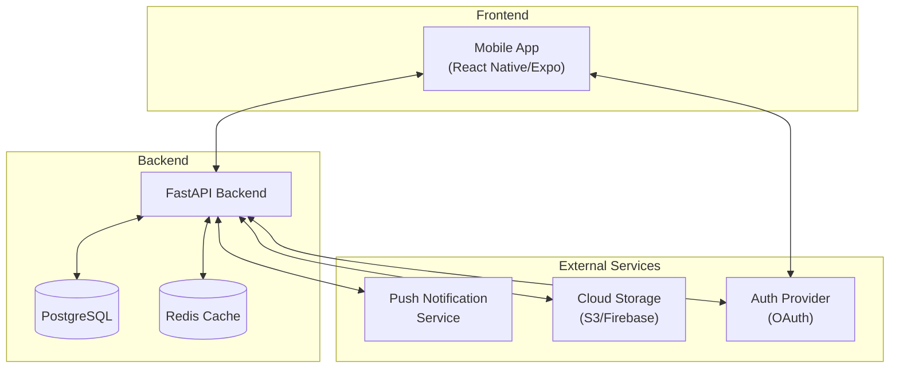
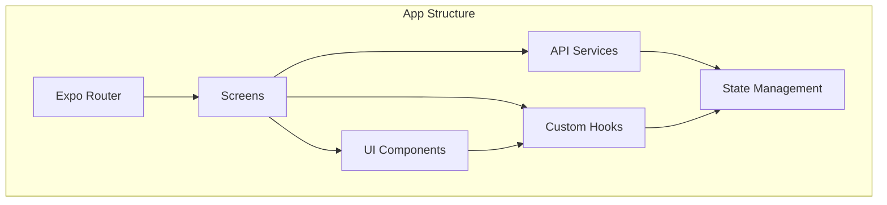
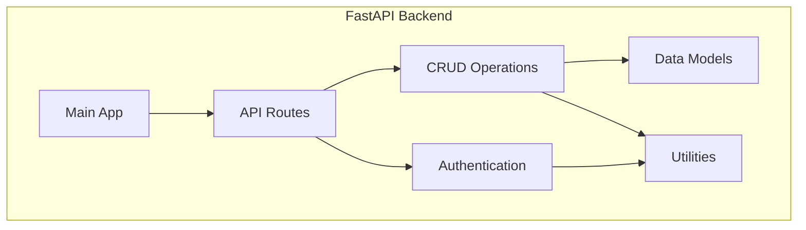
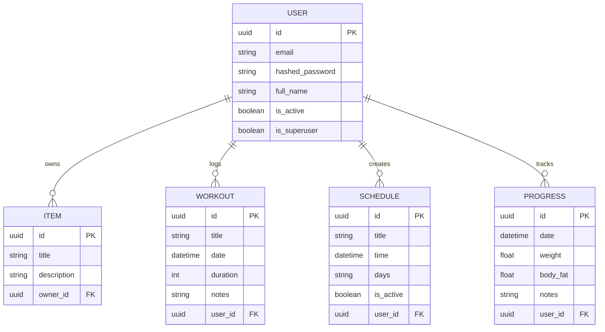
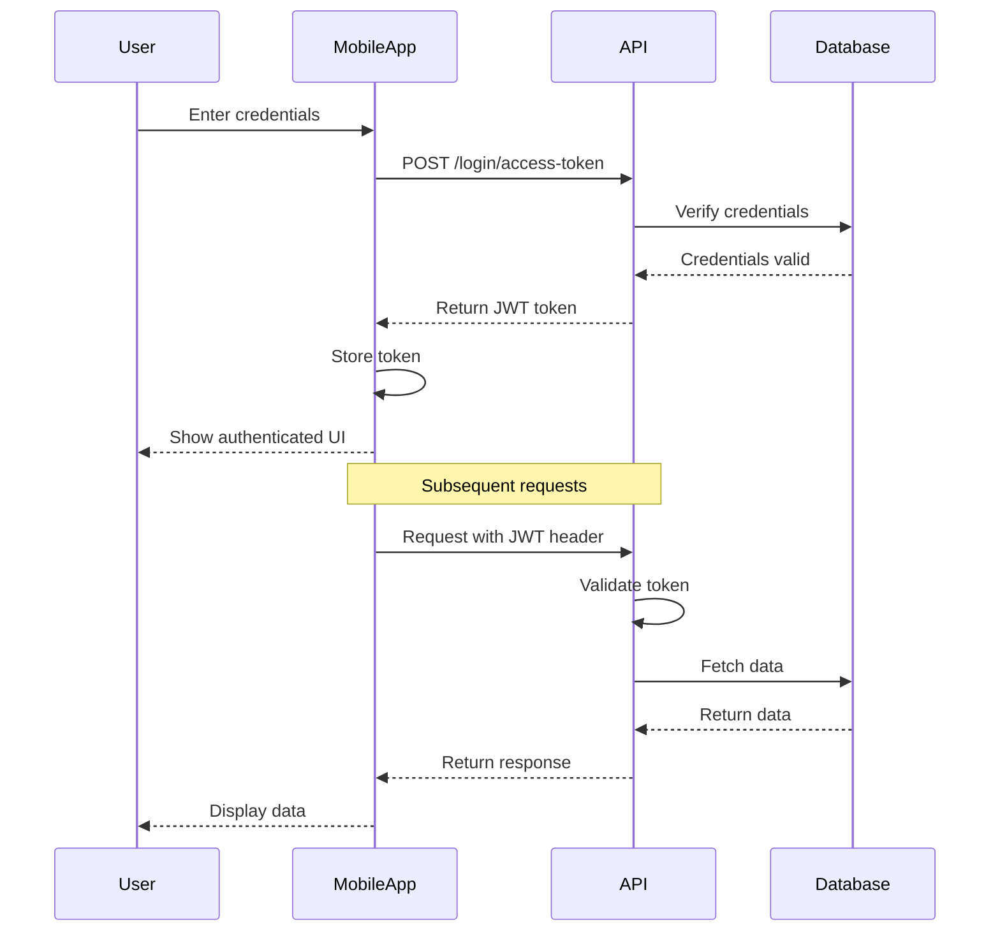
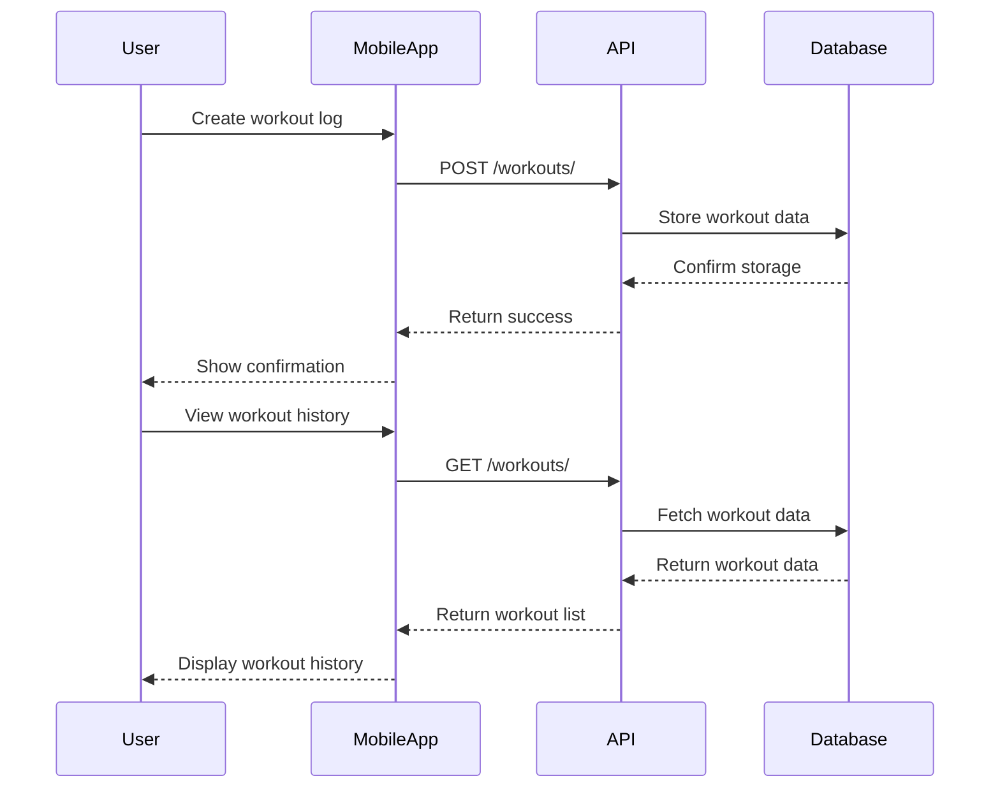
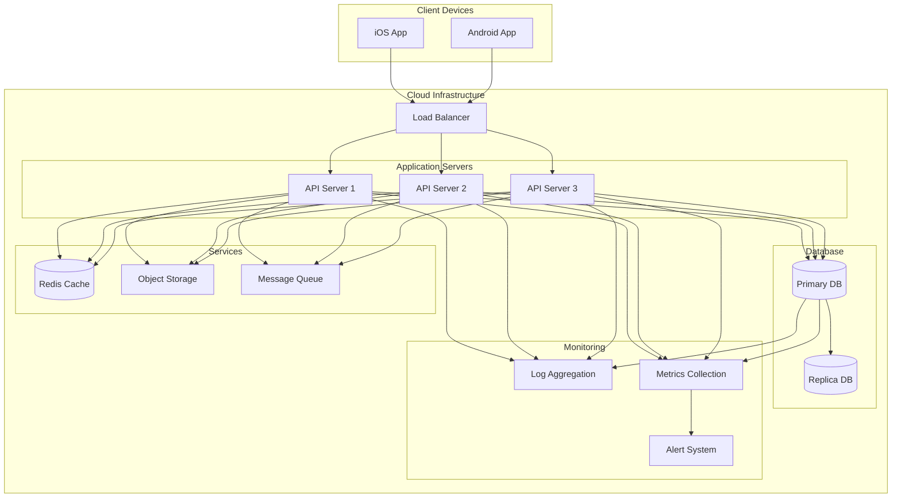
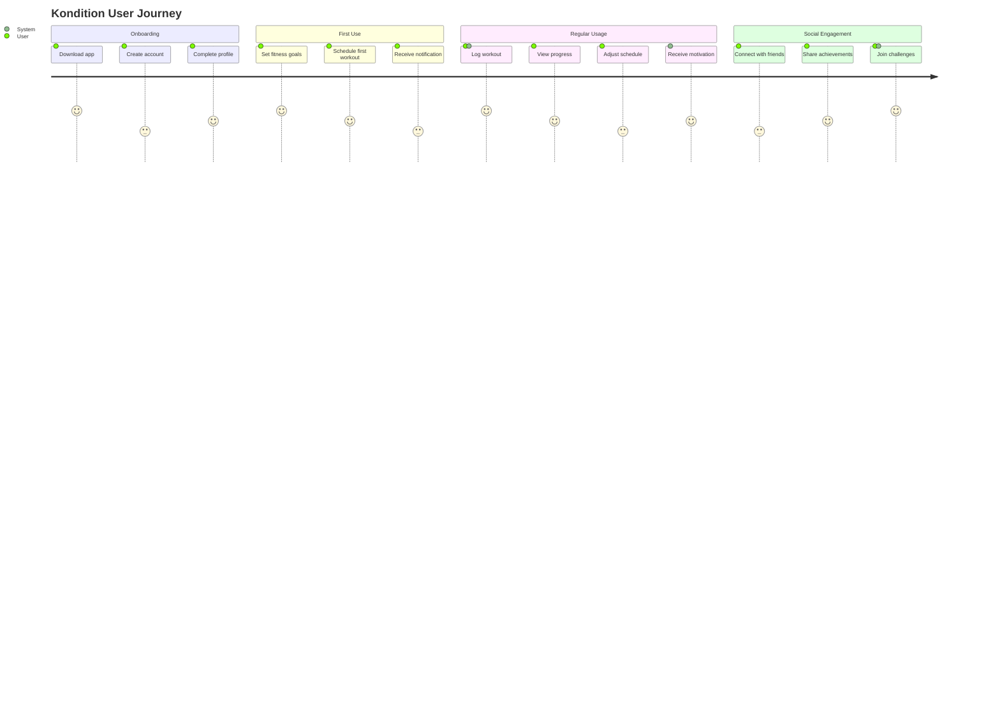

# Kondition Architecture Diagrams

This document provides visual representations of the Kondition fitness app architecture.

## System Architecture



## Frontend Architecture



## Backend Architecture



## Database Schema



## Authentication Flow



## Workout Logging Flow



## Deployment Architecture



## User Journey Map



## Feature Implementation Timeline

```mermaid
gantt
    title Kondition Feature Implementation
    dateFormat  YYYY-MM-DD
    section Authentication
    User Registration & Login      :a1, 2025-05-01, 14d
    Password Recovery              :a2, after a1, 7d
    OAuth Integration              :a3, after a2, 10d
    
    section Core Features
    Workout Logging                :b1, 2025-05-15, 14d
    Progress Tracking              :b2, after b1, 14d
    Scheduling                     :b3, after b1, 14d
    
    section Notifications
    Push Notifications Setup       :c1, 2025-06-01, 10d
    Workout Reminders              :c2, after c1, 7d
    Achievement Alerts             :c3, after c2, 7d
    
    section Social Features
    User Profiles                  :d1, 2025-06-15, 10d
    Friend Connections             :d2, after d1, 10d
    Activity Feed                  :d3, after d2, 14d
    Challenges & Leaderboards      :d4, after d3, 14d